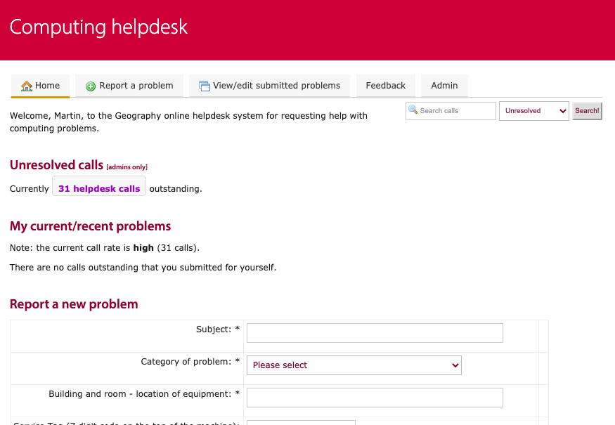

Simple helpdesk system
======================

This is a PHP application which implements a simple helpdesk system.

Screenshot
----------

Usage
-----

1. Clone the repository.
2. Within the directory, run `composer install`
3. Download the other library dependencies and ensure they are in your PHP include_path.
4. Download and install the famfamfam icon set in /images/icons/
5. Add the Apache directives in httpd.conf (and restart the webserver) as per the example given in .httpd.conf.extract.txt; the example assumes mod_macro but this can be easily removed.
6. Create a copy of the index.html.template file as index.html, and fill in the parameters.
7. Add a forwarding in /etc/aliases, e.g. `helpdesk: | php /path/to/example.com/computing/helpdesk/index.html ingestmail`
8. Create an /images/ directory alongside the boostrap file, and ensure it is writable by the incoming mail user
9. If using IMAP integration, ensure the PHP IMAP extension is loaded, e.g. `apt-get install php-imap && service apache2 restart`
10. Access the page in a browser at a URL which is served by the webserver.

Dependencies
------------

* [Composer](https://getcomposer.org/)
* [PHP IMAP extension](https://www.php.net/imap), if using IMAP integration
* [application.php application support library](https://download.geog.cam.ac.uk/projects/application/)
* [database.php database wrapper library](https://download.geog.cam.ac.uk/projects/database/)
* [frontControllerApplication.php front controller application implementation library](https://download.geog.cam.ac.uk/projects/frontcontrollerapplication/)
* [jquery.php jQuery abstraction library](https://download.geog.cam.ac.uk/projects/jquery/)
* [ultimateForm.php form library](https://download.geog.cam.ac.uk/projects/ultimateform/)
* [FamFamFam Silk Icons set](http://www.famfamfam.com/lab/icons/silk/)

Author
------

Martin Lucas-Smith, Department of Geography, 2003-21.

License
-------

GPL3.

